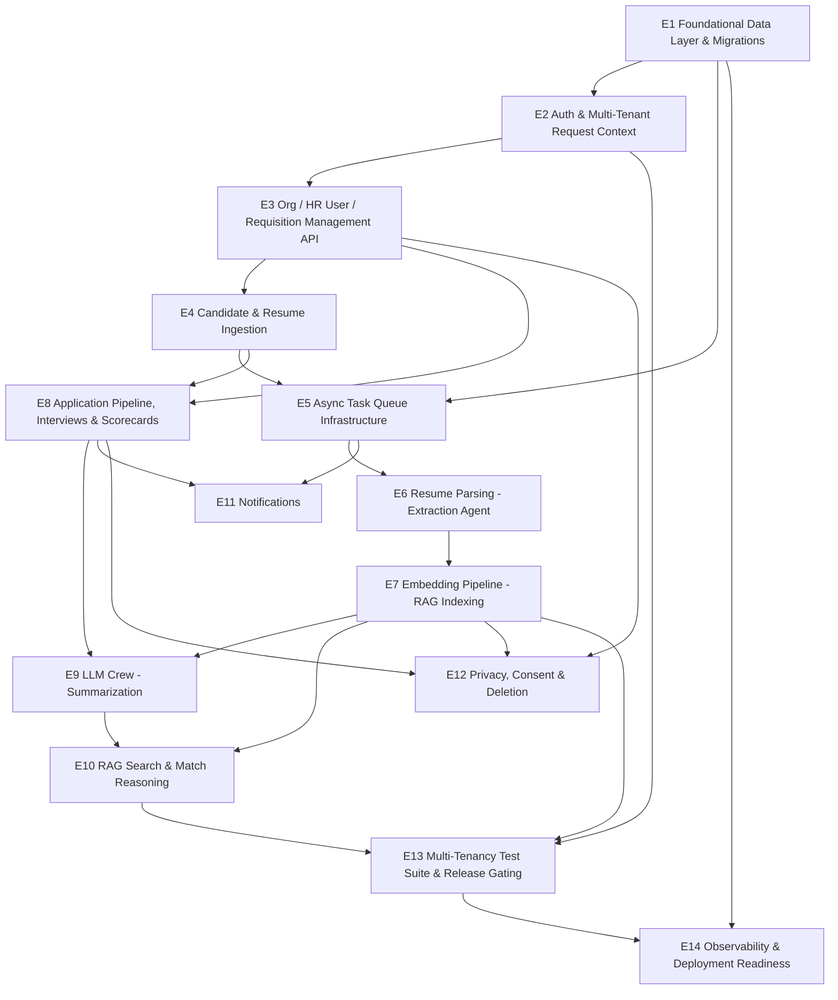

# Sift Backend — v1 Epics

**Purpose:** Break the backend work required for the v1 release (per [docs/09-roadmap.md](docs/09-roadmap.md)) into epics, sequenced by dependency, each traceable back to the ontology/invariants/architecture/stack docs it implements.

**Baseline (as of 2026-07-14):** The repo is scaffold-only. `app/{core,db,models,schemas,api/routes,services,workers,crew}` exist as empty packages (one `__init__.py` each); `app/main.py` has a real FastAPI instance with a `/health` route and nothing else. No models, no migrations, no endpoints, no workers, no crew agents. Every epic below starts from that empty state.

**Scope:** Backend only (FastAPI API + Celery workers + CrewAI crew + DB schema). Frontend, calendar integration, ATS export, and everything on the [Scope Creep Watchlist](docs/01-problem-space-and-scope.md) are excluded, matching the v1 "does NOT ship" row in [09-roadmap.md](docs/09-roadmap.md).

---

## Epic dependency graph

## Sequencing vs. roadmap

| Epics | Maps to [09-roadmap.md](docs/09-roadmap.md) phase | Notes |
|---|---|---|
| E1, E2 | v1a (Data model + FastAPI core) | Nothing else can start until these land. |
| E3, E4, E5 | v1a / v1b boundary | E5 (queue infra) is a prerequisite for E6 but can be built in parallel with E3/E4. |
| E6 | v1b (Ingestion + Extraction Agent parsing) | |
| E7 | v1e (Embedding pipeline + pgvector index) | |
| E8 | v1c (Pipeline + scorecards — backend portion only) | Can proceed in parallel with E6/E7; no data dependency between them. |
| E9, E10 | v1f / v1g (LLM crew, RAG search) | |
| E11 | Unchanged from prior design, threaded through v1c/v1b | |
| E12 | v1 ships list ("consent + deletion flow covering embeddings") | Needs E7 done since it must purge `resume_chunks`. |
| E13 | v1d (Multi-tenancy hardening + I2/I11 test suites) | Explicitly a release blocker per I2/I11 — not optional polish. |
| E14 | Cuts across v1a→v1g | Should be stood up early (skeleton) and hardened last. |

---

## E1 — Foundational Data Layer & Migrations

**Goal:** Stand up the real schema from [docs/05-data-model.md](docs/05-data-model.md) as SQLAlchemy models with Alembic migrations, including the `pgvector` extension and RLS policies.

**Key deliverables:**
- `app/db/base.py` — async engine/session setup, `DATABASE_URL` from settings.
- `app/models/` — one SQLAlchemy model per table: `organizations`, `hr_users`, `job_requisitions`, `candidates`, `resumes`, `resume_chunks`, `applications`, `interviews`, `scorecards`, `analysis_outputs`, `audit_log`, with native Postgres enums, the composite/partial unique constraints (e.g., `applications` unique-while-active), and the `VECTOR(1024)` column via `pgvector.sqlalchemy`.
- Alembic migration(s): enable `CREATE EXTENSION vector`, create all tables, HNSW index on `resume_chunks.embedding`, RLS policies keyed on `app.current_org_id` for every tenant-scoped table, the cross-table CHECK trigger enforcing I3, and the "no UPDATE on submitted scorecards" DB-role revocation for I4.
- `app/core/config.py` — Pydantic settings loading everything already listed in `.env.example`.

**Depends on:** Nothing (first epic).

**Docs/invariants:** [03-ontology.md](docs/03-ontology.md), [05-data-model.md](docs/05-data-model.md), I1–I11 in [04-invariants.md](docs/04-invariants.md).

**Definition of done:** `alembic upgrade head` runs clean against a local Postgres with `pgvector`; every table/constraint/index in 05-data-model.md exists; RLS is *on* but not yet exercised by app code (that's E2/E13).

---

## E2 — Auth & Multi-Tenant Request Context

**Goal:** Every authenticated request resolves to exactly one `organization_id`, sourced only from a verified session/token — never a client-supplied parameter — and that org_id is injected as the DB session variable RLS depends on.

**Key deliverables:**
- JWT validation against the managed auth provider's JWKS endpoint (`AUTH_JWKS_URL`/`AUTH_JWT_ISSUER`/`AUTH_JWT_AUDIENCE`), producing an `HRUser` + `organization_id` request context.
- FastAPI dependency that opens a DB transaction and `SET LOCAL app.current_org_id = :org_id` before any query runs, so RLS is live for every request.
- Candidate-side auth: magic-link / time-limited email token issuance and verification (no password), per A9.
- Role enforcement scaffolding (`hr_generalist`, `recruiter`, `hiring_manager`) for later per-route authorization, even if v1 doesn't yet need fine-grained role gating everywhere.

**Depends on:** E1 (models/session plumbing must exist to set org context against).

**Docs/invariants:** I2, I3 ("org_id spoofing" open question in [04-invariants.md](docs/04-invariants.md) should be resolved here, not deferred), [06-architecture.md](docs/06-architecture.md) Multi-tenancy section, [07-technical-stack.md](docs/07-technical-stack.md) auth rows.

**Definition of done:** No route can read or write data without a resolved org context; a request with a forged/omitted org claim is rejected before touching the DB; this is the dependency every other epic's endpoints/workers build on for org scoping.

---

## E3 — Organization / HR User / Requisition Management API

**Goal:** CRUD surface for the entities HR teams manage directly: organizations (admin-only), HR user invitation/lifecycle, job requisitions (including `scorecard_template`).

**Key deliverables:**
- `POST/GET /organizations` (bootstrap-only in v1, likely admin-tooling not self-serve signup).
- HR user invite → active → deactivated lifecycle endpoints.
- Job requisition CRUD, `status` transitions (`draft → open → on_hold/filled/cancelled`), `scorecard_template` validation.
- Pydantic request/response schemas in `app/schemas/`.

**Depends on:** E2.

**Docs/invariants:** [03-ontology.md](docs/03-ontology.md) (HRUser, JobRequisition lifecycle), A2/A3/A11 in [02-assumptions.md](docs/02-assumptions.md).

**Definition of done:** An HR user can be invited, log in, and create/manage a requisition end-to-end through the API, fully org-scoped.

---

## E4 — Candidate & Resume Ingestion

**Goal:** The synchronous half of the submission flow in [06-architecture.md](docs/06-architecture.md)'s sequence diagram: accept a resume file, store it, create/reuse the Candidate, create the Resume and Application rows, and enqueue parsing.

**Key deliverables:**
- `Ingestion Service` (`app/services/ingestion.py`) run inline on the request path per the architecture doc (not a separate deploy).
- `POST` resume-submission endpoint: candidate email/name intake, dedup-by-email per A8, file upload to S3 with `{org_id}/{resume_id}/{filename}` namespaced keys, signed-URL generation for later retrieval.
- Row creation: `Candidate` (create-or-reuse), `Resume` (`status=uploaded`), `Application` (`status=submitted`) in one transaction, respecting the partial-unique constraint (one active Application per Candidate+Requisition).
- Enqueue `parse_resume` job (stubbed until E5 exists, wired for real once it does).
- Web + email-in intake channels per the v1 ships list — email-in may be a thin adapter that normalizes into the same ingestion service call.

**Depends on:** E3 (needs Requisition to attach the Application to), E2.

**Docs/invariants:** I1, I3, A8, [06-architecture.md](docs/06-architecture.md) submission sequence, [08-privacy-and-compliance.md](docs/08-privacy-and-compliance.md) consent capture at intake.

**Definition of done:** Submitting a resume returns `202 Accepted` with Candidate/Resume/Application rows correctly linked and org-scoped; the file is retrievable only via a scoped signed URL; a job is enqueued (even if no worker consumes it yet).

---

## E5 — Async Task Queue Infrastructure

**Goal:** The Celery + Redis backbone every downstream worker epic (E6, E7, E9, E10, E11) builds on, including how org context travels with a job.

**Key deliverables:**
- `app/workers/celery_app.py` — Celery app config against `REDIS_URL`, task routing/queues per worker type (parsing, embedding, crew, notification) matching the "separate Fargate task definitions per worker type" decision in [07-technical-stack.md](docs/07-technical-stack.md).
- A shared task base class that requires an explicit `organization_id` in every job payload and sets `app.current_org_id` before the task body touches the DB — the async-path equivalent of E2's request-context dependency, since I2/I11 must hold for jobs, not just HTTP requests.
- Retry/backoff policy conventions for LLM-call-bound tasks (resolves the open question in [06-architecture.md](docs/06-architecture.md) about per-agent vs. crew-level retry units — recommend: crew-orchestrated task treated as one retryable unit for v1, revisit only if a specific agent failure mode demands finer granularity).
- Local dev entrypoint (`celery -A app.workers.celery_app worker`) documented in README/CLAUDE.md equivalent.

**Depends on:** E1, E4 (first real producer of jobs).

**Docs/invariants:** [06-architecture.md](docs/06-architecture.md) sync/async boundary table, I2/I11 (org context must not leak or get dropped between enqueue and execution).

**Definition of done:** A test task round-trips through Redis, executes with the correct org context set, and a task raising an exception is retried per policy rather than silently dropped.

---

## E6 — Resume Parsing (Extraction Agent)

**Goal:** The Parsing Worker: fetch the file, run the Extraction Agent (Claude Haiku 4.5), write `parsed_data`, enqueue embedding.

**Key deliverables:**
- `app/crew/agents/extraction.py` — CrewAI agent bound to Haiku 4.5 per the fixed model assignment in [07-technical-stack.md](docs/07-technical-stack.md).
- `parse_resume` Celery task: fetch from S3 → text extraction → structured field extraction (work history, education, skills) → write `resumes.parsed_data`, `status=parsed` → enqueue `embed_resume`.
- Failure path: any extraction exception sets `status=parse_failed` with `parse_error` populated — never left stuck in `parsing` (I6).
- `resumes.status` is worker-written only; confirm no API route exposes direct client writes to it.

**Depends on:** E5.

**Docs/invariants:** I6, [06-architecture.md](docs/06-architecture.md) Parsing Worker row, [07-technical-stack.md](docs/07-technical-stack.md) model assignment.

**Definition of done:** A submitted resume reaches `status=parsed` with populated `parsed_data` on the happy path, and reaches `status=parse_failed` (not stuck) on a forced failure; a monitoring hook/alert stub exists for resumes stuck in `parsing` past a timeout.

---

## E7 — Embedding Pipeline (RAG Indexing)

**Goal:** Chunk parsed resume text and populate `resume_chunks` so resumes become searchable, per the "Resume is now searchable via RAG" step in [06-architecture.md](docs/06-architecture.md).

**Key deliverables:**
- `app/services/chunking.py` — chunk size/overlap strategy for resume text (this is the implementation-detail tuning parameter flagged as an open question in [05-data-model.md](docs/05-data-model.md); pick a starting value, e.g. ~500 tokens / 50 overlap, and treat it as a service-config constant, not a schema concern).
- `embed_resume` Celery task: chunk → call Voyage AI (`voyage-3`) per chunk → upsert `resume_chunks` (delete-and-replace existing chunks for that `resume_id`, not versioned, per the doc's stated behavior).
- Enforce `organization_id` denormalization onto every chunk row at write time (this is the concrete implementation of I11's DB-layer backstop).

**Depends on:** E6.

**Docs/invariants:** I11, `resume_chunks` table spec in [05-data-model.md](docs/05-data-model.md), Embedding Worker row in [06-architecture.md](docs/06-architecture.md).

**Definition of done:** A parsed resume produces `resume_chunks` rows with correct `organization_id`, ordinal `chunk_index`, and 1024-dim embeddings; re-running embedding on the same resume replaces rather than duplicates chunks; an ANN query against the HNSW index returns results scoped correctly (full cross-tenant proof is E13, but a same-org smoke query belongs here).

---

## E8 — Application Pipeline, Interviews & Scorecards

**Goal:** The backend half of "pipeline + scorecards" — status transitions, interview scheduling metadata, and scorecard submission/amendment with full audit trail. This is the highest-invariant-density epic (I4, I5, I7, I8) and has no data dependency on the RAG/crew side, so it can run in parallel with E6/E7.

**Key deliverables:**
- Application status-transition endpoint backed by an explicit state machine matching the diagram in [04-invariants.md](docs/04-invariants.md) exactly — reject any (from, to) pair not on that diagram (I5).
- Interview CRUD (`scheduled/completed/cancelled/no_show`), always referencing exactly one Application (I7).
- Scorecard submission endpoint: create as `draft`, transition to `submitted` (locks further direct writes), enforced 1:1 with Interview via the DB unique constraint (I8).
- Scorecard amendment endpoint (distinct from update): writes the change plus an `audit_log` row in the same transaction, preserving the original (I4).
- `audit_log` write path — append-only, no update/delete exposed anywhere in the API.

**Depends on:** E3, E4.

**Docs/invariants:** I4, I5, I7, I8, state diagram in [04-invariants.md](docs/04-invariants.md), `scorecards`/`interviews`/`audit_log` tables in [05-data-model.md](docs/05-data-model.md).

**Definition of done:** State-machine unit tests enumerate every (from, to) pair from the diagram and only the valid ones succeed; submitting then amending a scorecard leaves both the original and an audit_log entry queryable; a direct update attempt on a submitted scorecard is rejected at the DB layer, not just the API layer.

---

## E9 — LLM Crew: Summarization

**Goal:** On-demand candidate/Application summary generation — the Summarizer Agent half of the LLM crew, gated so it only ever sees submitted scorecards (I10).

**Key deliverables:**
- `app/crew/agents/summarizer.py` — CrewAI agent bound to Sonnet 5.
- `app/crew/crew.py` — the shared crew definition referenced by both this epic and E10 ("both jobs share the same underlying crew definition with different entry tasks" per [06-architecture.md](docs/06-architecture.md)).
- Data-fetch step that queries `scorecards WHERE status = 'submitted'` exclusively before building agent context — the concrete I10 enforcement point.
- `generate_summary` Celery task: on-demand trigger → write/upsert `analysis_outputs` (`summary`, `source_scorecard_ids`, `crew_run` model-provenance metadata, `generated_at`).
- Staleness handling: flip `analysis_outputs.stale = true` when a new Scorecard is submitted for that Application after `generated_at`; lazy regeneration triggered on next view request rather than eagerly.
- `GET` endpoint to fetch (and lazily trigger regeneration of) an Application's current summary.

**Depends on:** E8 (needs submitted scorecards to summarize), E7 (shared crew scaffolding is more naturally built once the embedding side exists, though not a hard data dependency — sequenced here per the roadmap's v1f grouping).

**Docs/invariants:** I10, `analysis_outputs` table, Summarizer row in [06-architecture.md](docs/06-architecture.md), model assignment in [07-technical-stack.md](docs/07-technical-stack.md).

**Definition of done:** Integration test: create a draft scorecard alongside submitted ones for the same Application, trigger analysis, assert the draft's content appears nowhere in the generated output or the crew's retrieved context; regenerating overwrites in place (no history table).

---

## E10 — RAG Search & Match Reasoning

**Goal:** HR-initiated, query-scoped candidate search: embed the query, run an org-scoped ANN search, then have the Reasoning Agent produce a per-candidate rationale — never a blended ranking score, per the deliberate scope framing in [06-architecture.md](docs/06-architecture.md).

**Key deliverables:**
- `app/crew/agents/reasoning.py` — CrewAI agent bound to Opus 4.8.
- Search endpoint: accepts free-text query + optional `requisition_id`, enqueues a search job with `org_id` in the payload (never inferred from content).
- `search` Celery task: embed query (Voyage) → `resume_chunks` ANN query with the RLS-backed org filter applied *before* similarity ranking (I11) → Reasoning Agent call over the retrieved, already-scoped chunks only → write/refresh `analysis_outputs.match_rationale` for matched Applications.
- Result delivery: since this is enqueued-but-interactive per the sync/async boundary table, implement either short-polling (`GET /search/{job_id}`) or an equivalent status-check endpoint — a full streaming implementation is explicitly an open question in [06-architecture.md](docs/06-architecture.md) and can be deferred past v1 if polling is acceptable for the pilot.
- Response shape: ranked-by-relevance list of candidates with rationale text and a link back to the full record — no single blended score field.

**Depends on:** E7, E9 (shares the crew definition and `analysis_outputs` write path).

**Docs/invariants:** I11 (this is called out as the highest-risk new surface in the architecture doc — treat its cross-tenant test with the same severity as I2), RAG search sequence diagram in [06-architecture.md](docs/06-architecture.md).

**Definition of done:** Seed two orgs with semantically near-identical resume content; search as Org A; assert zero Org B chunks are ever retrieved or reasoned over, and the response contains rationale text, not a bare ranking score.

---

## E11 — Notifications

**Goal:** Transactional email on pipeline state changes (unchanged from the original design, per [06-architecture.md](docs/06-architecture.md)).

**Key deliverables:**
- `notify` Celery task consuming events from Application status transitions and Scorecard submission.
- Integration with the transactional email provider (Postmark/SES per [07-technical-stack.md](docs/07-technical-stack.md)) via `EMAIL_PROVIDER_API_KEY`.
- Template set for the minimum v1 notification set (submission confirmation, status change, interview scheduled) — exact list should be confirmed against product needs, not expanded speculatively.

**Depends on:** E5, E8 (the events it reacts to).

**Docs/invariants:** Notification Worker row in [06-architecture.md](docs/06-architecture.md), async classification in the sync/async boundary table.

**Definition of done:** An Application status transition or scorecard submission reliably enqueues and sends the corresponding email in a dev/sandbox provider setup, without blocking the triggering API request.

---

## E12 — Privacy, Consent & Deletion

**Goal:** Implement I9's right-to-be-forgotten routine end-to-end, including the RAG-pipeline-specific purge behavior added in the 2026-07-14 pivot, plus consent capture at intake.

**Key deliverables:**
- Consent capture at resume submission (candidate-facing disclosure of AI processing, per [08-privacy-and-compliance.md](docs/08-privacy-and-compliance.md)).
- Deletion endpoint/routine: anonymize `candidates.full_name/email/phone` in place, set `pii_deleted_at`, anonymize free-text scorecard fields referencing the candidate by name — all without deleting rows (preserves I9's aggregate-analytics guarantee).
- Hard-delete (not anonymize) `resume_chunks` and the resume file in object storage for the deleted candidate, since chunk_text/file content is derived directly from PII being purged.
- Retention-window enforcement per the retention table in [08-privacy-and-compliance.md](docs/08-privacy-and-compliance.md), if any automatic (non-request-driven) retention expiry is in v1 scope — confirm this with the product owner before building, since the doc's retention table may be schedule-driven rather than purely request-driven.

**Depends on:** E3 (candidate ownership), E8, E7 (chunks to purge).

**Docs/invariants:** I9, [08-privacy-and-compliance.md](docs/08-privacy-and-compliance.md) deletion flow diagram and consent flow.

**Definition of done:** Integration test: trigger deletion, assert PII fields are anonymized and `resume_chunks`/file are gone, assert aggregate requisition funnel counts are unchanged.

---

## E13 — Multi-Tenancy Test Suite & Release Gating

**Goal:** The automated cross-tenant test suite that [04-invariants.md](docs/04-invariants.md) and [09-roadmap.md](docs/09-roadmap.md) both call a release blocker, not a regular test class — covering both I2 (relational data) and I11 (vector search).

**Key deliverables:**
- Test harness: seed two organizations with overlapping/near-identical data (including semantically similar resumes for the vector case).
- I2 suite: authenticated as Org A, attempt to read every Org B entity by ID across every resource type, assert 404/denied on all of them.
- I11 suite: run a vector similarity search as Org A seeded to be a near-perfect semantic match for Org B content, assert zero Org B chunks/candidates are returned regardless of similarity score.
- Wire this suite into CI as a required, non-skippable check gating merges to main / release builds — matching "treated as a release blocker" language in the invariants doc, not just documented intent.

**Depends on:** E2, E7, E10 (needs both relational and RAG surfaces built to have something to test).

**Docs/invariants:** I2, I11, the v1→v2 exit criteria in [09-roadmap.md](docs/09-roadmap.md) ("Zero cross-tenant data isolation incidents... on every deploy").

**Definition of done:** Suite runs in CI, fails the build on any cross-tenant leak, and is documented as a required check (not an optional/best-effort test file).

---

## E14 — Observability & Deployment Readiness

**Goal:** The minimum operational scaffolding needed to run this in a pilot: structured logging, health checks per worker type, error tracking, and deployable configs matching the Fargate task-definition-per-worker-type decision in [07-technical-stack.md](docs/07-technical-stack.md).

**Key deliverables:**
- Structured logging (org_id, request_id/job_id correlation) across API and all worker types.
- `/health` (already stubbed) extended with a real readiness check (DB + Redis connectivity); equivalent liveness signal for each Celery worker type.
- Error tracking integration (e.g., Sentry) for both API and worker processes.
- The monitoring alert for resumes stuck in `parsing` past a timeout threshold, called for explicitly in I6's operational enforcement.
- Deployment configs: separate task definitions for API, parsing worker, embedding worker, crew worker, notification worker, matching the independent-scaling rationale in [07-technical-stack.md](docs/07-technical-stack.md) (actual Terraform/CDK/IaC authorship may be a separate infra-owned effort — this epic's backend-side deliverable is making each process independently runnable/configurable via env vars, not necessarily writing the IaC itself).

**Depends on:** E1 (baseline), E13 (nothing ships to a pilot without the isolation suite green).

**Docs/invariants:** I6 operational enforcement note, Hosting row in [07-technical-stack.md](docs/07-technical-stack.md).

**Definition of done:** Every process type can be started independently with its own health signal; a resume stuck in `parsing` triggers an alert; API and worker errors surface in a trackable place, not just stdout.

---

## Cross-cutting risks carried over from the docs

These are open questions already flagged in the docs that materially affect backend build order or scope, worth resurfacing here rather than re-litigating from scratch:

| Risk | Source | Implication for epic sequencing |
|---|---|---|
| RAG search (E7/E9/E10) is a sequential dependency before pilot onboarding in the current roadmap timeline. | [09-roadmap.md](docs/09-roadmap.md) open questions | If the team wants to de-risk pilot timing, E8 (pipeline/scorecards) could ship as a leaner backend-only v1 slice while E6/E7/E9/E10 follow as a fast-follow — worth a product decision before E9/E10 are scheduled, not a backend-only call. |
| No fallback/secondary LLM provider. | [07-technical-stack.md](docs/07-technical-stack.md) | E9/E10 should at minimum have circuit-breaking/graceful-degradation behavior (e.g., search fails loudly with a retry, doesn't silently return partial cross-agent state) even without a second provider — worth a design note inside E9/E10, not a new epic. |
| `resume_chunks.embedding` dimension (1024, `voyage-3`) has no documented migration plan. | [05-data-model.md](docs/05-data-model.md), [07-technical-stack.md](docs/07-technical-stack.md) | Low urgency for v1 (no model swap planned), but E7 should isolate the embedding-model reference behind one config point so a future re-embed migration isn't a full rewrite. |
| `audit_log` has no partitioning/archival strategy. | [05-data-model.md](docs/05-data-model.md) | Explicitly deferred to v2 in the doc; E1 should just make sure the table isn't designed in a way that blocks adding partitioning later (e.g., avoid non-partitionable constraints). |
