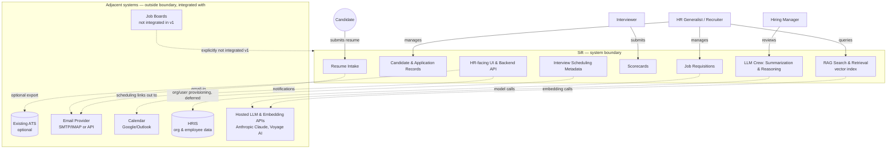

# 01 — Problem Space and Scope

**Purpose:** Define the problem precisely (not as a solution in disguise) and draw a hard boundary around what v1 will and will not do.

**Depends on:** [00-ideation.md](00-ideation.md) (problem framing, non-goals, users).
**Feeds into:** [02-assumptions.md](02-assumptions.md) (assumptions are only meaningful once scope is fixed) and [09-roadmap.md](09-roadmap.md) (phases are scope commitments over time).

---

## Precise problem statement

> HR teams cannot reliably answer "what is the current, complete state of this candidate's pipeline?" at the moment a hiring decision needs to be made, because resume intake, requisition matching, and interview feedback each live in different uncoordinated systems (email, spreadsheets, chat, memory), with no shared record and no enforced structure.

Note what this statement does *not* say: it does not say "we need an AI resume screener" or "we need a Kanban board." Those are candidate solutions. The problem is the *absence of a single structured, up-to-date record* connecting candidate → requisition → interview feedback. Any v1 design must be evaluated against whether it closes that specific gap.

## In-scope vs out-of-scope (v1)

| Area | In scope | Out of scope |
|---|---|---|
| Resume intake | Upload via web form, email-in address, structured parsing into candidate fields | Sourcing/scraping candidates from job boards or LinkedIn |
| Candidate record | Single structured record per organization with parsed resume data, contact info, application history within that org | Global candidate identity shared/deduplicated across organizations |
| Requisition management | Create/edit job requisitions, link applications to them | Full org-chart/headcount planning, budget approval workflows |
| Application pipeline | Status tracking through a defined state machine (see [04-invariants.md](04-invariants.md)) | Configurable/custom pipeline stages per organization (v1 ships one fixed pipeline) |
| Interview scheduling | Record interview metadata (who, when, which application) | Native calendar UI / free-busy negotiation (v1 links out to existing calendar tools) |
| Interview feedback | Structured scorecards (ratings + free text) per interview | Video/audio recording, transcription, or sentiment analysis of interviews |
| Analysis output | Structured summarization of resume + aggregated scorecards for a hiring manager view, produced by a multi-model LLM crew (see [06-architecture.md](06-architecture.md)) | Autonomous candidate ranking or auto-recommendation with no human query behind it |
| Resume search & retrieval | HR-initiated semantic search over resumes within one organization via a RAG pipeline (vector search + LLM-generated match rationale against a specific query or requisition) | Background/always-on ranking of the full candidate pool; using match output to auto-advance, auto-reject, or gate a pipeline stage |
| Multi-org support | Multiple organizations on one platform, strictly isolated (isolation now also covers the vector index, not just relational data) | Cross-org candidate matching, talent marketplace, or referral network |
| Communication | Transactional email notifications (application received, interview scheduled, decision made) | Marketing/nurture email sequences to candidates |
| Compliance | Basic consent capture, PII deletion on request | Full legal compliance certification (see [08-privacy-and-compliance.md](08-privacy-and-compliance.md) — flagged for legal review) |

## Scope Creep Watchlist

Each of these will be proposed during the project's life. Each is explicitly out for v1, with the condition that would justify reconsidering it.

| Tempting feature | Why it's out for v1 | What would need to be true to bring it in |
|---|---|---|
| **Autonomous candidate ranking/auto-scoring (background, no query, gates a decision)** | Turns Sift into a decision-maker instead of a record-keeper; introduces bias, liability, and explainability problems before the underlying structured data even exists to rank against. **Note:** this is distinct from the v1 RAG search/matching capability below, which is HR-initiated, query-scoped, and advisory only — see [06-architecture.md](06-architecture.md) for where that boundary is drawn. | A full cycle of structured scorecard + resume data exists across multiple orgs, legal has reviewed disparate-impact risk, and ranking is opt-in/advisory only, never gating. |
| **Full ATS replacement (offers, e-signature, onboarding)** | Each of these is its own regulated, integration-heavy domain (e-signature has legal requirements; onboarding touches payroll/HRIS). Building them dilutes focus on the actual gap: pipeline visibility. | Sift has proven the pipeline/scorecard core with real orgs, and there's demand to consolidate rather than integrate with an existing ATS/HRIS. |
| **Video interview recording/analysis** | High storage cost, consent complexity (multi-jurisdiction recording consent laws), and no evidence the core problem (missing structured feedback) requires video — a structured scorecard captures the decision-relevant signal. | Scorecard adoption is high and organizations specifically request recording for compliance/training, with legal sign-off on consent handling per jurisdiction. |
| **Native sourcing / job board syndication** | Different problem entirely (finding candidates vs. processing ones who already applied); pulls in job-board API integrations and posting-management UI unrelated to the core gap. | Organizations using Sift consistently report sourcing as their top unmet need, not just intake/tracking. |
| **Full ATS replacement via deep 3rd-party ATS integration (bi-directional sync)** | Two-way sync with external ATS systems risks data conflicts and is a significant integration surface per-vendor; v1 needs to work standalone first. | A specific, named integration is requested by a paying org and one-way export (already in v2, see roadmap) is proven insufficient. |
| **Custom/configurable pipeline stages per organization** | Configurability multiplies the state machine's test surface and UI complexity before we know if the fixed pipeline actually fits most orgs. | Multiple pilot orgs hit concrete cases where the fixed pipeline breaks their process, not just preference. |
| **Candidate-facing self-service portal (status tracking, profile editing)** | Candidates are a secondary user in v1 (submit + receive notifications only); a full portal is a second UI surface with its own auth/session needs. | Candidate volume and repeat-application rate justify the build; validated via the notification-only flow first. |

## Scope boundary (bounded context)

`F` (LLM Crew) and `H` (RAG Search & Retrieval) sit inside the system boundary — Sift owns the vector index and the orchestration of which model does what — but both depend on the hosted LLM/embedding provider as an external adjacent system, the same way email delivery is external. Candidate PII (resume text, chunks) leaving the boundary to reach that provider is a compliance-relevant data flow, tracked in [08-privacy-and-compliance.md](08-privacy-and-compliance.md).

The dotted lines are integration points, not data ownership — Sift does not own calendar state, email delivery, or ATS records. It owns candidate, application, requisition, interview-metadata, and scorecard data for the duration those entities are within its defined lifecycle (see [04-invariants.md](04-invariants.md)).

## Open Questions

- Should v1 support a one-way *export* to an existing ATS (CSV/API push) even though bi-directional sync is out of scope? Leaning yes for v2 — see roadmap.
- Is "one fixed pipeline" per organization sufficient, or do we need at least *stage renaming* (not reordering/adding) as a v1 concession?
- Where exactly does "interview scheduling metadata" end and "calendar integration" begin — do we store proposed time slots, or only the finalized time once set elsewhere?
