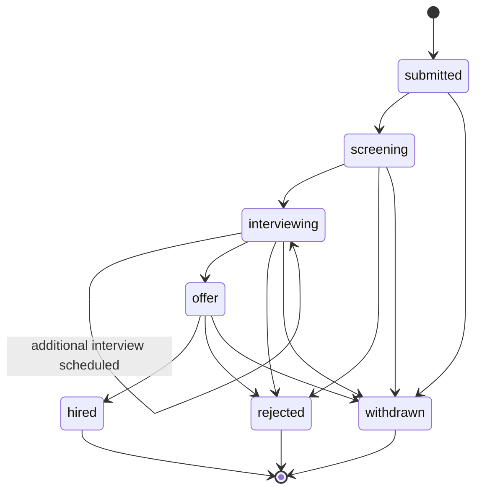

# 04 — Invariants

**Purpose:** State the rules that must always hold, regardless of implementation detail, and how each is enforced and tested.

**Depends on:** [03-ontology.md](03-ontology.md) (invariants are statements about these entities and their relationships).
**Feeds into:** [05-data-model.md](05-data-model.md) (marks which invariants become DB constraints vs. application logic) and [06-architecture.md](06-architecture.md) (multi-tenancy and async design must not violate these).

---

## How to read this document

For each invariant: **what it guarantees**, **what enforces it**, **what happens if violated**, and **how it's tested**. Enforcement is called out as DB-layer, application-layer, or both — the split is finalized in [05-data-model.md](05-data-model.md).

## Data ownership and isolation invariants

### I1 — A Resume always belongs to exactly one Candidate
- **Enforced by:** Foreign key `resumes.candidate_id NOT NULL`, no nullable/orphan state permitted (DB layer).
- **If violated:** Orphaned or ambiguous resume data — parsing/analysis output can't be attributed, breaking the core value prop.
- **Tested by:** Constraint-level test (insert without candidate_id fails); integration test asserting every upload flow creates or reuses a Candidate before a Resume row exists.

### I2 — A Candidate's PII is never visible across Organization boundaries
- **Enforced by:** Every PII-bearing table carries `organization_id`; row-level security (RLS) policy at the DB layer scopes all reads to the requesting user's organization (application layer sets session context; DB layer enforces it — belt and suspenders). See multi-tenancy design in [06-architecture.md](06-architecture.md). This explicitly extends to the vector index: `resume_chunks` (embeddings, see [05-data-model.md](05-data-model.md)) carries `organization_id` and is covered by the same RLS policy, and every vector similarity query is issued with the requesting session's org scope already applied — a query can never rank or return chunks from another organization, regardless of how semantically similar they are.
- **If violated:** Cross-tenant data leak — the most severe possible failure for this system, both legally and reputationally. A vector-search-specific violation is especially insidious: an unscoped similarity query wouldn't error, it would silently return another organization's candidates ranked by relevance.
- **Tested by:** Automated cross-tenant access test suite run on every deploy: authenticated as Org A, attempt to read every Org B entity by ID, assert 404/denied on all of them — including issuing a vector similarity search seeded with Org B resume content and asserting zero Org B chunks are returned to Org A. This test class is treated as a release blocker, not a regular test.

### I3 — A JobRequisition, Candidate, and Application in a relationship all belong to the same Organization
- **Enforced by:** Application-layer validation at Application creation (Candidate.organization_id must equal JobRequisition.organization_id); reinforced by DB constraint where feasible (composite FK or check constraint, detailed in [05-data-model.md](05-data-model.md)).
- **If violated:** Would silently break I2 by creating a cross-org linkage.
- **Tested by:** Unit test on Application creation rejecting mismatched organization_ids.

## Lifecycle invariants

### I4 — An Interview Scorecard cannot be edited after Interview.status = "completed" without an audit trail entry
- **Enforced by:** Application-layer: once `scorecards.status = submitted`, further writes are rejected by the normal update path; a separate "amend" operation is required, which writes a new audit_log row referencing the original and the change (DB layer: `scorecards` rows are effectively append-only post-submission — no UPDATE granted on submitted rows at the DB role/permission level).
- **If violated:** Silent post-hoc editing of interview feedback — undermines the trustworthiness of the hiring record, which is the entire point of structured scorecards.
- **Tested by:** Integration test: submit a scorecard, attempt direct update, assert rejection; attempt amendment, assert both original and audit_log entry are preserved and queryable.

### I5 — An Application's status can only move along defined transitions (no arbitrary jumps)
- **Enforced by:** Application-layer state machine guard on every status write; DB-layer CHECK constraint restricting `status` to the enum of valid values (does not by itself prevent invalid *transitions*, only invalid *values* — transition validity is application-layer).
- **If violated:** Pipeline data becomes inconsistent (e.g., "hired" candidate with no interview history), breaking pipeline visibility, the core problem this system solves per [01-problem-space-and-scope.md](01-problem-space-and-scope.md).
- **Tested by:** State-machine unit tests enumerating every (from, to) pair, asserting only the valid ones succeed.

**Valid Application status transitions:**

`withdrawn` (candidate-initiated) is reachable from every non-terminal state; `rejected` (org-initiated) is reachable from `screening`, `interviewing`, and `offer` but not directly from `submitted` — a candidate must at least enter screening before rejection, ensuring every rejection has some minimal review step attached (a deliberate process rule, not just a data rule).

### I6 — A Resume moves through parsing states without skipping failure handling
- **Enforced by:** Application-layer: the parsing worker is the only writer of `resumes.status`; direct client writes to this field are not exposed via the API.
- **If violated:** A resume could appear `parsed` with no actual extracted data, silently degrading downstream analysis.
- **Tested by:** Worker unit tests asserting `parse_failed` is set (not left `parsing` indefinitely) on any extraction exception; a monitoring alert on Resumes stuck in `parsing` past a timeout threshold (operational enforcement, not test-time).

## Referential and business-rule invariants

### I7 — An Interview always references exactly one Application
- **Enforced by:** FK `interviews.application_id NOT NULL` (DB layer).
- **If violated:** Feedback becomes unattributable to a specific pipeline instance, breaking the hiring-manager summary use case.
- **Tested by:** Constraint-level test.

### I8 — A Scorecard exists for at most one Interview, and vice versa
- **Enforced by:** Unique constraint on `scorecards.interview_id` (DB layer).
- **If violated:** Ambiguous which scorecard is authoritative for an interview, breaking I4's amendment trail (which amendment applies to which original?).
- **Tested by:** Constraint-level test (insert second scorecard for same interview_id fails).

### I9 — Deleting/anonymizing a Candidate's PII (right-to-be-forgotten) does not delete aggregate pipeline analytics
- **Enforced by:** Application-layer deletion routine anonymizes PII fields (name, email, phone, resume file, free-text scorecard fields referencing the candidate by name) in place, rather than hard-deleting rows, preserving counts/status-transition timestamps needed for the success metrics in [00-ideation.md](00-ideation.md). Full detail in [08-privacy-and-compliance.md](08-privacy-and-compliance.md).
- **If violated:** Either PII persists after a deletion request (compliance failure) or historical pipeline analytics silently break (operational failure).
- **Tested by:** Integration test: trigger deletion, assert PII fields are anonymized, assert aggregate counts (e.g., requisition funnel numbers) are unchanged.

## AI pipeline invariants

### I10 — An AnalysisOutput is only ever generated from submitted Scorecards, never draft ones
- **Enforced by:** Application-layer: the LLM crew's data-fetch step queries `scorecards WHERE status = 'submitted'` exclusively; draft scorecards are never included in the context passed to the Summarizer or Reasoning agent, even partially.
- **If violated:** A hiring manager could see a summary reflecting an interviewer's still-editable, not-yet-finalized impressions as if they were final — undermining the same trust guarantee I4 protects for scorecards individually.
- **Tested by:** Integration test: create a draft scorecard alongside submitted ones for the same Application, trigger analysis, assert the draft's content does not appear in the generated output or the crew's retrieved context.

### I11 — RAG search and match results are always scoped to the requesting HR user's Organization, with no ranking or retrieval across the boundary
- **Enforced by:** Application-layer: every embedding query is issued through a data-access path that injects the session's `organization_id` filter before the similarity search runs (mirrors I2's application-layer enforcement); DB-layer RLS on `resume_chunks` as the backstop, per I2 above.
- **If violated:** Same failure mode as I2, specifically surfaced through the search feature — the highest-risk new surface introduced by the RAG pipeline, since it's designed to actively surface and rank candidates rather than passively store them.
- **Tested by:** Same cross-tenant test suite as I2, plus a dedicated case: seed Org A and Org B with semantically near-identical resumes, run a search as Org A, assert only Org A's candidate appears regardless of similarity score.

## Open Questions

- Should I5's rule "rejection requires passing through screening" be configurable per organization, or is it a fixed process guarantee we're comfortable enforcing universally in v1?
- For I4, what is the maximum allowed window for the *original* scorecard submission itself to be treated as a draft-in-progress vs. requiring the amendment path — is same-day editing before "submit" unlimited, or time-boxed?
- Does I2 need to additionally guard against organization_id spoofing at the API layer (e.g., a compromised client sending a different org_id), or is session-derived org context (never client-supplied) sufficient — this should be confirmed as a hard requirement in [06-architecture.md](06-architecture.md).
- For I10, should a hiring manager be able to see a count of "N scorecards still in draft" alongside the analysis output (metadata, not content) so they know the summary may be incomplete, without violating the spirit of I4/I10?
- For I11, does the LLM crew's Reasoning agent itself need a hard technical guardrail (not just a data-scoping one) preventing it from ever being prompted with cross-org context in a single call, as defense-in-depth beyond the retrieval scoping?
