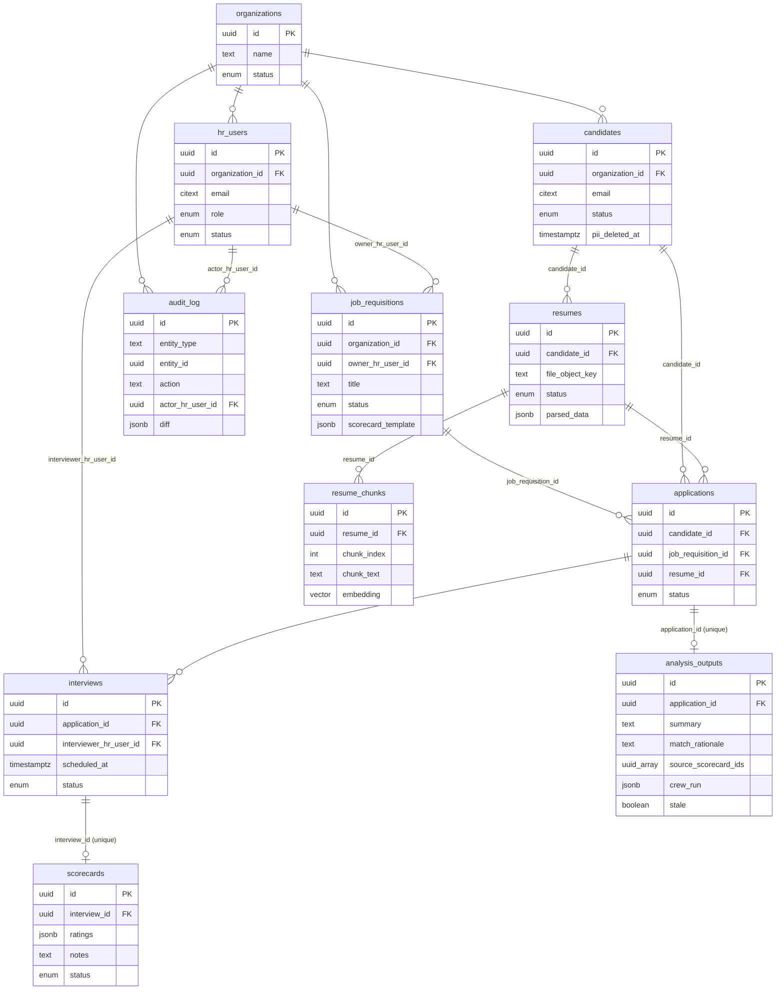

# 05 — Data Model

**Purpose:** Translate the ontology into a concrete schema — tables, fields, types, and constraints — and state which invariants are enforced where.

**Depends on:** [03-ontology.md](03-ontology.md) (entities and relationships) and [04-invariants.md](04-invariants.md) (which rules become constraints).
**Feeds into:** [06-architecture.md](06-architecture.md) (storage layer design) and [07-technical-stack.md](07-technical-stack.md) (concrete DB choice).

---

## Conventions

- All tables have `id UUID PRIMARY KEY DEFAULT gen_random_uuid()` and `created_at`, `updated_at TIMESTAMPTZ` unless noted.
- All tenant-scoped tables carry `organization_id UUID NOT NULL REFERENCES organizations(id)` and are covered by a Postgres row-level security policy keyed on it (enforces **I2**, and by extension **I11** for the vector table below).
- Enum-typed columns use Postgres native `ENUM` types for DB-layer value validation; *transition* validity (which enum-to-enum moves are legal) is application-layer per **I5**.
- The `pgvector` extension (`CREATE EXTENSION vector`) is enabled on the primary database — see [07-technical-stack.md](07-technical-stack.md) for why this rides on the existing PostgreSQL instance rather than a separate vector database.

## Schema

### organizations
| Field | Type | Constraints |
|---|---|---|
| id | UUID | PK |
| name | TEXT | NOT NULL |
| status | ENUM(active, suspended, deactivated) | NOT NULL, DEFAULT 'active' |
| created_at, updated_at | TIMESTAMPTZ | NOT NULL |

### hr_users
| Field | Type | Constraints |
|---|---|---|
| id | UUID | PK |
| organization_id | UUID | NOT NULL, FK → organizations |
| email | CITEXT | NOT NULL, UNIQUE per organization_id (composite unique constraint) |
| full_name | TEXT | NOT NULL |
| role | ENUM(hr_generalist, recruiter, hiring_manager) | NOT NULL |
| status | ENUM(invited, active, deactivated) | NOT NULL, DEFAULT 'invited' |
| created_at, updated_at | TIMESTAMPTZ | NOT NULL |

*Enforces I2 (RLS root) and A2/A3 (single-org membership, fixed role enum) from [02-assumptions.md](02-assumptions.md).*

### job_requisitions
| Field | Type | Constraints |
|---|---|---|
| id | UUID | PK |
| organization_id | UUID | NOT NULL, FK → organizations |
| title | TEXT | NOT NULL |
| department | TEXT | nullable (free-text, per ontology decision to not model Department as an entity) |
| owner_hr_user_id | UUID | NOT NULL, FK → hr_users |
| status | ENUM(draft, open, on_hold, filled, cancelled) | NOT NULL, DEFAULT 'draft' |
| scorecard_template | JSONB | NOT NULL — defines the competency fields interviewers will rate (supports A11's "default set, definable per requisition") |
| created_at, updated_at | TIMESTAMPTZ | NOT NULL |

### candidates
| Field | Type | Constraints |
|---|---|---|
| id | UUID | PK |
| organization_id | UUID | NOT NULL, FK → organizations |
| email | CITEXT | NOT NULL, UNIQUE per organization_id (enforces A8 dedup key) |
| full_name | TEXT | NOT NULL |
| phone | TEXT | nullable |
| status | ENUM(active, archived, deleted) | NOT NULL, DEFAULT 'active' |
| pii_deleted_at | TIMESTAMPTZ | nullable — set when I9's anonymization routine runs |
| created_at, updated_at | TIMESTAMPTZ | NOT NULL |

*On `status = deleted`: application-layer routine overwrites `full_name`, `email`, `phone` with anonymized placeholders and sets `pii_deleted_at`, satisfying I9 without deleting the row (preserves FK integrity for historical applications/scorecards).*

### resumes
| Field | Type | Constraints |
|---|---|---|
| id | UUID | PK |
| organization_id | UUID | NOT NULL, FK → organizations (denormalized from candidate for RLS simplicity) |
| candidate_id | UUID | NOT NULL, FK → candidates (**enforces I1**) |
| file_object_key | TEXT | NOT NULL — pointer to object storage, not the file itself |
| status | ENUM(uploaded, parsing, parsed, parse_failed) | NOT NULL, DEFAULT 'uploaded' |
| parsed_data | JSONB | nullable — structured extraction: work history, education, skills |
| parse_error | TEXT | nullable |
| created_at, updated_at | TIMESTAMPTZ | NOT NULL |

### resume_chunks
The vector index backing RAG search — a derived, regenerable artifact of `resumes` (see [03-ontology.md](03-ontology.md), "not first-class" list).

| Field | Type | Constraints |
|---|---|---|
| id | UUID | PK |
| organization_id | UUID | NOT NULL, FK → organizations (denormalized for RLS; **enforces I2/I11**) |
| resume_id | UUID | NOT NULL, FK → resumes, ON DELETE CASCADE |
| chunk_index | INT | NOT NULL — ordinal position within the resume's chunked text |
| chunk_text | TEXT | NOT NULL — the source text this vector represents, needed to show retrieval provenance in search results |
| embedding | VECTOR(1024) | NOT NULL — pgvector column, dimensioned for the voyage-3 embedding model (see [07-technical-stack.md](07-technical-stack.md)) |
| created_at | TIMESTAMPTZ | NOT NULL |

Constraints: `UNIQUE (resume_id, chunk_index)`. An HNSW index (`USING hnsw (embedding vector_cosine_ops)`) is built per the pgvector extension for approximate nearest-neighbor query performance; the RLS policy filters by `organization_id` before the ANN search runs, not after, so the isolation guarantee (**I11**) holds even under approximate search.

*On Resume re-parse/re-embed: existing chunks for that `resume_id` are deleted and replaced, not versioned — chunk history has no independent value once superseded.*
*On Candidate PII deletion (I9): `resume_chunks` rows are deleted (not anonymized) as part of the deletion routine, since chunk_text is derived directly from the resume content being purged — see updated flow in [08-privacy-and-compliance.md](08-privacy-and-compliance.md).*

### applications
| Field | Type | Constraints |
|---|---|---|
| id | UUID | PK |
| organization_id | UUID | NOT NULL, FK → organizations |
| candidate_id | UUID | NOT NULL, FK → candidates |
| job_requisition_id | UUID | NOT NULL, FK → job_requisitions |
| resume_id | UUID | NOT NULL, FK → resumes — pinned snapshot reference per ontology note, not a live pointer |
| status | ENUM(submitted, screening, interviewing, offer, hired, rejected, withdrawn) | NOT NULL, DEFAULT 'submitted' |
| created_at, updated_at | TIMESTAMPTZ | NOT NULL |

Constraints:
- `UNIQUE (candidate_id, job_requisition_id) WHERE status NOT IN ('rejected', 'withdrawn')` — enforces "at most one *active* Application per (Candidate, JobRequisition)" while allowing reapplication after a terminal outcome, resolving the Open Question from [03-ontology.md](03-ontology.md) in favor of allowing reapplication.
- CHECK constraint (trigger, since it's cross-table) verifying `candidates.organization_id = job_requisitions.organization_id = applications.organization_id` — DB-layer reinforcement of **I3** (primary enforcement remains application-layer at creation time).

### interviews
| Field | Type | Constraints |
|---|---|---|
| id | UUID | PK |
| organization_id | UUID | NOT NULL, FK → organizations |
| application_id | UUID | NOT NULL, FK → applications (**enforces I7**) |
| interviewer_hr_user_id | UUID | NOT NULL, FK → hr_users |
| scheduled_at | TIMESTAMPTZ | NOT NULL |
| status | ENUM(scheduled, completed, cancelled, no_show) | NOT NULL, DEFAULT 'scheduled' |
| created_at, updated_at | TIMESTAMPTZ | NOT NULL |

### scorecards
| Field | Type | Constraints |
|---|---|---|
| id | UUID | PK |
| organization_id | UUID | NOT NULL, FK → organizations |
| interview_id | UUID | NOT NULL, UNIQUE, FK → interviews (**enforces I8**) |
| ratings | JSONB | NOT NULL — keyed to the owning requisition's `scorecard_template` |
| notes | TEXT | nullable |
| status | ENUM(draft, submitted, amended) | NOT NULL, DEFAULT 'draft' |
| submitted_at | TIMESTAMPTZ | nullable |
| created_at, updated_at | TIMESTAMPTZ | NOT NULL |

*Row-level UPDATE is revoked at the DB role level once `status = submitted` for all fields except via the amendment stored procedure, which writes to `audit_log` in the same transaction — DB-layer enforcement of **I4**.*

### analysis_outputs
The cached result of the LLM crew running over an Application — a derived artifact, same status as `resume_chunks` (see [03-ontology.md](03-ontology.md)).

| Field | Type | Constraints |
|---|---|---|
| id | UUID | PK |
| organization_id | UUID | NOT NULL, FK → organizations |
| application_id | UUID | NOT NULL, UNIQUE, FK → applications, ON DELETE CASCADE — one current output per Application, overwritten on regeneration |
| summary | TEXT | NOT NULL — Summarizer agent output |
| match_rationale | TEXT | nullable — Reasoning agent output when generated against a specific JobRequisition's criteria |
| source_scorecard_ids | UUID[] | NOT NULL — the exact set of submitted Scorecards this output was generated from (**enforces I10**'s auditability: proves no draft scorecard was included) |
| crew_run | JSONB | NOT NULL — records which model handled each agent role and prompt/response metadata for reproducibility (e.g., `{"extraction": "claude-haiku-4-5", "summarization": "claude-sonnet-5", "reasoning": "claude-opus-4-8"}`) |
| generated_at | TIMESTAMPTZ | NOT NULL |
| stale | BOOLEAN | NOT NULL, DEFAULT false — flipped true when a new Scorecard is submitted for this Application after `generated_at`, triggering lazy regeneration on next view per [06-architecture.md](06-architecture.md) |

*Regenerated in place (upsert on `application_id`), not versioned — only the current output is a first-class concern in v1; `crew_run` provides enough of an audit trail for "what produced this" without keeping full history of every past regeneration.*

### audit_log
| Field | Type | Constraints |
|---|---|---|
| id | UUID | PK |
| organization_id | UUID | NOT NULL, FK → organizations |
| entity_type | TEXT | NOT NULL (e.g., 'scorecard') |
| entity_id | UUID | NOT NULL |
| action | TEXT | NOT NULL (e.g., 'amended') |
| actor_hr_user_id | UUID | NOT NULL, FK → hr_users |
| diff | JSONB | NOT NULL — before/after of amended fields |
| created_at | TIMESTAMPTZ | NOT NULL |

Append-only by convention (no UPDATE/DELETE grants at the DB role level) — this table is itself the enforcement mechanism for I4's audit trail requirement, so it cannot be mutable.

## Schema-level ER diagram

## Invariant enforcement summary

| Invariant | DB layer | Application layer |
|---|---|---|
| I1 (Resume → one Candidate) | FK NOT NULL | — |
| I2 (no cross-org PII) | RLS policy on every tenant table | Session context sets org scope; never trusts client-supplied org_id |
| I3 (same-org relationships) | Trigger-based CHECK across FKs | Primary validation at Application creation |
| I4 (Scorecard immutability) | UPDATE revoked post-submit; amendment via stored procedure | Amendment endpoint writes audit_log in same transaction |
| I5 (valid status transitions) | CHECK constraint on enum values only | State-machine guard on every transition |
| I6 (Resume parse state integrity) | — | Worker is sole writer of `resumes.status`; not client-exposed |
| I7 (Interview → one Application) | FK NOT NULL | — |
| I8 (Scorecard ↔ Interview 1:1) | UNIQUE constraint | — |
| I9 (deletion preserves aggregates) | Anonymization overwrites fields in place, no row deletion | Deletion routine orchestrates the overwrite + timestamp |
| I10 (AnalysisOutput reflects only submitted Scorecards) | `source_scorecard_ids` column makes the input set auditable after the fact | Crew's data-fetch step filters to `status = 'submitted'` before generation |
| I11 (RAG search never crosses org boundary) | RLS on `resume_chunks`, filtered before ANN search executes | Data-access layer injects `organization_id` into every embedding query |

## Open Questions

- Should `scorecard_template` live on `job_requisitions` (as modeled) or be an organization-level default with per-requisition override — current design assumes per-requisition is the primary unit, confirm this matches A11.
- Is JSONB sufficient for `parsed_data` and `ratings` long-term, or will query patterns (e.g., "find all candidates with 5+ years Python") demand promoting specific fields to indexed columns sooner than expected?
- Does `audit_log` need partitioning/archival strategy from day one given it's append-only and will grow unbounded, or is this a v2 operational concern?
- Is a fixed chunk size/overlap strategy for `resume_chunks` (not yet specified numerically here) something to lock down in this doc, or is it an implementation-detail tuning parameter that belongs in the ingestion service's own config rather than the schema doc?
- Should `resume_chunks.embedding` dimension (1024, tied to voyage-3) be treated as a schema migration risk to plan for now — i.e., does swapping embedding models later require a full re-embed + dimension migration, and is that acceptable operationally?
