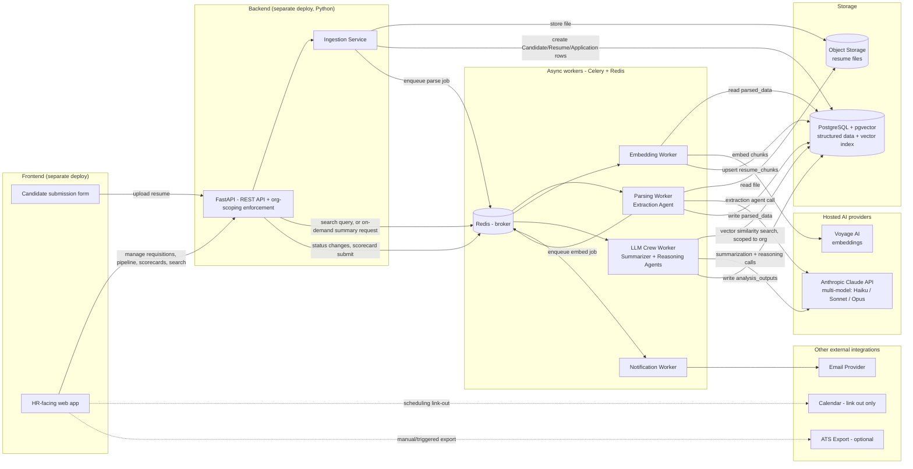
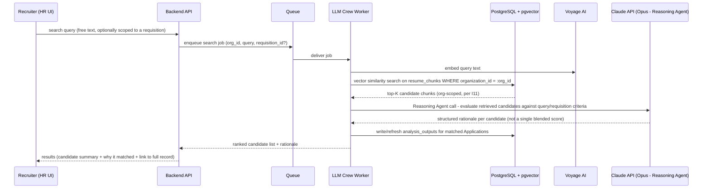

# 06 — Architecture

**Purpose:** Define the system's components, how data flows through them, what runs synchronously vs. asynchronously, and how multi-tenancy is enforced.

**Depends on:** [05-data-model.md](05-data-model.md) (storage shape) and [04-invariants.md](04-invariants.md) (I2/I11 in particular drive the multi-tenancy and vector-isolation design).
**Feeds into:** [07-technical-stack.md](07-technical-stack.md) (concrete technology choices for each component below).

> **Revision note:** this document was substantially redrawn to introduce a separate Python backend, a RAG-based vector search pipeline, and a multi-model LLM crew (distinct agents/models for extraction, summarization, and reasoning) as core v1 components, replacing the earlier single "Analysis Worker" design. See [01-problem-space-and-scope.md](01-problem-space-and-scope.md) for the scope boundary this draws around search/matching, and [CHANGELOG.md](../CHANGELOG.md) for when this changed.

---

## Component overview

The frontend and backend are two separately deployable services in two different languages — the frontend never talks to the database, object storage, queue, or LLM/embedding providers directly, only to the backend's API.



## Component responsibilities

| Component | Responsibility | Notes |
|---|---|---|
| Frontend (Next.js) | HR dashboard, candidate submission form | Pure API client — no direct DB/storage/AI access, satisfying a hard separation between backend and frontend. |
| Backend API (FastAPI) | Auth validation, org-scoping enforcement, request/response schemas, synchronous writes | The single place org context is resolved from a session and injected into every downstream query — see Multi-tenancy below. |
| Ingestion Service | Resume upload handling: file storage + row creation + enqueue | Runs inside the backend process on the request path (not a separate deploy), synchronous. |
| Parsing Worker (Extraction Agent) | Text extraction from resume file + structured field extraction | First LLM crew agent; high-volume, lowest-complexity task — see model assignment in [07-technical-stack.md](07-technical-stack.md). |
| Embedding Worker | Chunks parsed resume text and generates vector embeddings | Not itself an LLM crew agent — a separate, simpler pipeline step calling the embedding provider directly. Writes to `resume_chunks` (see [05-data-model.md](05-data-model.md)). |
| LLM Crew Worker (Summarizer + Reasoning agents) | Two jobs: (1) on-demand candidate/Application summary generation, (2) RAG search — retrieves relevant `resume_chunks` for a query, then the Reasoning agent evaluates retrieved candidates against the query/requisition and produces a rationale | Orchestrated as a CrewAI crew — see [07-technical-stack.md](07-technical-stack.md) for why. Both jobs share the same underlying crew definition with different entry tasks. |
| Notification Worker | Sends transactional email on state changes | Unchanged from prior design. |
| PostgreSQL + pgvector | Structured relational data and the vector index in one database | See Multi-tenancy below for why this is one database, not two systems. |
| Object storage (S3) | Raw resume files | Unchanged from prior design. |

## Data flow: resume submission to searchable, analyzable record

```mermaid
sequenceDiagram
    participant C as Candidate
    participant API as Backend API (FastAPI)
    participant Obj as Object Storage
    participant DB as PostgreSQL + pgvector
    participant Q as Queue (Redis/Celery)
    participant Par as Parsing Worker
    participant Emb as Embedding Worker
    participant LLM as Claude API
    participant Vy as Voyage AI

    C->>API: POST resume file + requisition_id
    API->>Obj: store raw file
    API->>DB: create/reuse Candidate, create Resume (status=uploaded), create Application (status=submitted)
    API-->>C: 202 Accepted (submission confirmed)
    API->>Q: enqueue parse_resume job

    Q->>Par: deliver parse_resume job
    Par->>Obj: fetch file
    Par->>LLM: Extraction Agent call (structured field extraction)
    Par->>DB: update Resume (status=parsed, parsed_data)
    Par->>Q: enqueue embed_resume job

    Q->>Emb: deliver embed_resume job
    Emb->>Emb: chunk parsed resume text
    Emb->>Vy: generate embeddings per chunk
    Emb->>DB: upsert resume_chunks (org-scoped)
    Note over DB: Resume is now searchable via RAG
```

## Data flow: RAG search and candidate matching (recruiter-initiated)

This is the sequence for the "resume search & retrieval" capability in [01-problem-space-and-scope.md](01-problem-space-and-scope.md) — deliberately human-initiated per query, never a background batch process, per **I11**.



Two things worth calling out about this flow:
1. **Retrieval, then reasoning — never reasoning without retrieval scoping.** The vector search happens first and is org-scoped at the query level (I11); the Reasoning agent only ever sees chunks that already passed that filter, so there's no path where cross-org data reaches the LLM call.
2. **Output is a rationale per candidate, not a single ranked score.** This is a deliberate framing choice tied to the Scope Creep Watchlist boundary in [01-problem-space-and-scope.md](01-problem-space-and-scope.md): the UI presents this as "here's why these came up," not "here's your ranked shortlist," to keep the feature a search/discovery aid rather than something that reads as an automated hiring decision.

## Synchronous vs. asynchronous boundary

| Operation | Sync or Async | Why |
|---|---|---|
| Resume file upload + record creation | Sync | Candidate needs immediate confirmation the submission was received. |
| Resume parsing (Extraction Agent) | Async | LLM call latency; not needed for submission confirmation. |
| Resume embedding | Async | Chained after parsing; no user is waiting on it synchronously. |
| Application status transitions (HR-initiated) | Sync (the write itself) | HR users expect immediate UI feedback. |
| Notifications triggered by status transitions | Async | Email delivery latency shouldn't block the HR user's UI action. |
| Scorecard submission | Sync (the write itself) | Interviewer needs confirmation before navigating away. |
| Candidate/Application summary generation (LLM Crew) | Async, on-demand, cached in `analysis_outputs` | Multi-step multi-model calls take seconds; UI shows a loading state, not a blocking wait — see A17 in [02-assumptions.md](02-assumptions.md). |
| RAG search query | Async from the API's perspective (enqueued), but UX-interactive — the UI polls/streams for results rather than blocking the HTTP request | A search is initiated synchronously by a user waiting for a response, but the actual embed → retrieve → reason pipeline is multi-step and must not hold an HTTP connection open for tens of seconds. |
| ATS export (v2+) | Async | Bulk export operations should not block the initiating UI action. |

## Multi-tenancy approach

Single shared PostgreSQL database (with the `pgvector` extension), single shared object storage bucket, tenant isolation enforced at three layers (defense in depth, directly implementing **I2** and its vector-search-specific instantiation, **I11**, from [04-invariants.md](04-invariants.md)):

1. **Application layer:** every authenticated request resolves to exactly one `organization_id` from the session/token — never accepted as a client-supplied parameter for scoping decisions. This applies identically to a REST request for a Candidate record and to a RAG search job enqueued for the LLM Crew Worker: the org_id travels with the job payload, not with anything the worker infers from content.
2. **Database layer:** Postgres Row-Level Security (RLS) policies on every tenant-scoped table, including `resume_chunks`, keyed to a session variable (`app.current_org_id`) set at the start of each request/job's DB transaction. The ANN index scan is filtered by this policy *before* ranking by similarity, not after — so a cross-org match is never computed, let alone returned.
3. **Object storage layer:** file keys are namespaced by organization (`{org_id}/{resume_id}/{filename}`), and the storage access layer generates only scoped, time-limited signed URLs.

**Why keep the vector index inside the same PostgreSQL instance instead of a dedicated vector database (Qdrant/Weaviate/Pinecone)?** This is the single most consequential new architecture decision in this revision, so it's worth stating plainly: a dedicated vector database would very likely out-perform pgvector at large scale and offers richer hybrid-search features. But it would also be a *second* stateful system that has to correctly enforce per-organization isolation — doubling the surface area I2/I11 have to be verified against, and doubling the operational burden (backups, access control, a second production dependency) for a target scale (A14) that pgvector comfortably serves. Given how severe a cross-tenant leak would be for this product, collapsing to one system with one well-tested isolation mechanism is the safer default for v1. Revisit if resume volume or query latency outgrows pgvector's ANN performance — see [07-technical-stack.md](07-technical-stack.md).

## Open Questions

- Should the LLM Crew Worker's search jobs be rate-limited/queued per-organization to prevent one high-volume org from starving search latency for others — same question as before, now sharper given search is interactive, not just background analysis?
- At what resume/chunk volume does pgvector's ANN query latency degrade enough to force a re-evaluation of the dedicated-vector-DB alternative rejected above?
- Does the RAG search UX need a "streaming" response (partial results as the crew works) given the multi-step embed → retrieve → reason pipeline, or is a single loading state through to completion acceptable for v1?
- Should Extraction, Summarization, and Reasoning agents be separate Celery task types with independent retry/backoff policies, or one crew-orchestrated task treated as a single unit of work for retry purposes?
