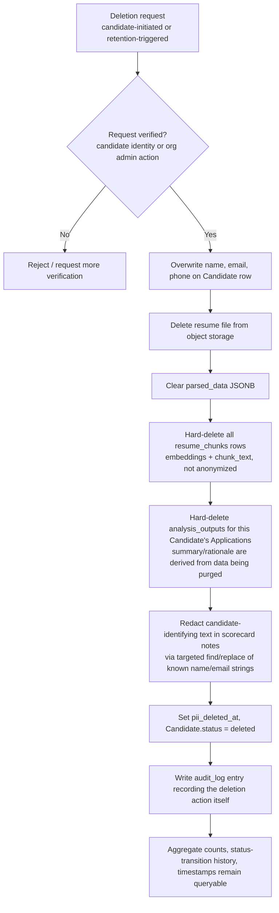

# 08 — Privacy and Compliance

**Purpose:** Define what personal data is collected, how it's protected and deleted, and which legal regimes must be considered before launch.

**Depends on:** [05-data-model.md](05-data-model.md) (what PII fields exist) and [06-architecture.md](06-architecture.md) (multi-tenancy/isolation mechanism this document relies on).
**Feeds into:** [09-roadmap.md](09-roadmap.md) (compliance readiness gates phase exit criteria).

> **This document is not legal advice.** It records product/engineering decisions and flags where formal legal review is required before launch. Items marked **[NEEDS LEGAL REVIEW]** must be signed off by qualified counsel before this system processes real candidate data in the relevant jurisdiction.

---

## What PII is collected

| Data | Source | Where stored | Notes |
|---|---|---|---|
| Full name, email, phone | Candidate submission | `candidates` table (PostgreSQL) | Primary identity fields; email is the dedup key per A8 in [02-assumptions.md](02-assumptions.md). |
| Resume file (may contain address, photo, nationality, age indicators depending on candidate's own content) | Candidate upload | Object storage, org-namespaced key | Sift does not request these fields; whatever the candidate includes in their own document is stored as-is. |
| Parsed work history, education, skills | Derived from resume via parsing worker | `resumes.parsed_data` (JSONB) | Derived PII — same sensitivity as source resume. |
| Interview scorecard notes (may reference candidate by name, may contain subjective assessment) | Interviewer input | `scorecards` table | Sensitive — this is evaluative data about a person, arguably higher-stakes than the resume itself. |
| Resume text chunks + vector embeddings | Derived from parsed resume via the embedding pipeline | `resume_chunks` table (pgvector) | Same sensitivity as the source resume — `chunk_text` is a verbatim excerpt, and the embedding vector is a compressed representation that is not human-readable but is not legally "anonymous" (it can be used for similarity matching back to identifying content). See [06-architecture.md](06-architecture.md). |
| LLM crew output (summaries, match rationale) | Generated by the LLM crew from resume + submitted scorecard content | `analysis_outputs` table | Derived evaluative data about a candidate — same sensitivity class as scorecard notes, since it's synthesized from them. |
| HR user name, email | Org invitation/signup | `hr_users` table | Employee (not candidate) PII — lower sensitivity but still in scope for org-level data-subject rights. |

**Explicitly not collected in v1** (per Scope Creep Watchlist in [01-problem-space-and-scope.md](01-problem-space-and-scope.md)): no video/audio recordings, no biometric data, no government ID numbers, no explicit demographic/EEO data collection forms (candidates may voluntarily include such info in a resume, which Sift does not parse into structured fields or use in any scoring).

### Third-party subprocessors introduced by the AI pipeline

Resume text and scorecard content now leave Sift's infrastructure boundary to reach two hosted AI providers, per [06-architecture.md](06-architecture.md) and [07-technical-stack.md](07-technical-stack.md):

| Provider | What it receives | Purpose |
|---|---|---|
| Anthropic (Claude API) | Resume text (extraction), resume + scorecard text (summarization), retrieved resume chunks + query text (reasoning/matching) | Powers all three LLM crew agent roles |
| Voyage AI | Resume chunk text, search query text | Generates embeddings for the RAG vector index |

Both are data **subprocessors** of Sift with respect to each Organization's candidate data. **[NEEDS LEGAL REVIEW — a Data Processing Agreement (or equivalent subprocessor terms) must be in place with both providers, and each Organization's own DPA with Sift must disclose these as subprocessors, before this pipeline processes real candidate data in a regulated jurisdiction.]**

## Retention policy

| State | Retention | Rationale |
|---|---|---|
| Active Application (any non-terminal status) | Retained indefinitely while active | Needed for the pipeline visibility this system exists to provide. |
| Terminal Application (`hired`, `rejected`, `withdrawn`) | Retained 24 months post-terminal-status by default **[NEEDS LEGAL REVIEW — retention periods vary significantly by jurisdiction and by whether the org needs adverse-action defense records]** | Balances typical employment-claim statute-of-limitations windows against minimizing stored PII. Configurable per organization once legal review sets safe bounds. |
| Candidate record with no Application (shouldn't normally occur, but covers edge cases) | 90 days | No legitimate business purpose to retain longer without an associated pipeline. |
| Audit log entries | Retained for the life of the referenced entity plus the same retention window — never deleted independently of the entity it audits | The audit trail (enforcing **I4**) is meaningless if it can be deleted while the scorecard it documents still exists. |

Retention is enforced by a scheduled job that flags eligible Candidate/Application records for the deletion routine below — not immediate hard deletion at the retention boundary, to allow for an organization-configurable grace period.

## Deletion / right-to-be-forgotten handling

Implements invariant **I9** from [04-invariants.md](04-invariants.md): deletion **anonymizes** PII fields rather than removing rows, preserving referential integrity and aggregate analytics.

Note on `resume_chunks` and `analysis_outputs`: unlike the Candidate row itself (anonymized in place per **I9**), these two tables are **hard-deleted**, not anonymized, because they exist only to serve search/retrieval and summarization — there is no aggregate-analytics reason to retain a deleted candidate's embeddings or LLM-generated summary the way there is for pipeline funnel counts. This also removes them from the vector index immediately, so a deleted candidate can never surface in a future RAG search result.

Note on scorecard redaction: this is a best-effort targeted redaction (known name/email strings), not a guarantee that free-text notes contain zero indirect identifying information — interviewers should be trained not to write identifying details unnecessary to the evaluation itself. **[NEEDS LEGAL REVIEW — whether best-effort redaction of free-text fields meets the deletion standard required in target jurisdictions, or whether full note deletion is required upon request even at the cost of losing evaluative history.]**

### Deletion propagation to third-party subprocessors

Deleting `resume_chunks` and `analysis_outputs` from Sift's own database does not, by itself, guarantee data sent to Anthropic or Voyage AI during processing is purged from those providers' systems. **[NEEDS LEGAL REVIEW — confirm each provider's data retention terms for API inputs (e.g., whether prompts/inputs are retained for abuse monitoring, and for how long), and whether Sift's deletion routine needs an explicit provider-side deletion call or is covered by the providers' standard retention/deletion terms under their DPA.]**

## Consent flow for candidates

Resume submission requires an explicit, unchecked-by-default checkbox at the point of upload:

> "I consent to [Organization Name] storing and processing my resume and application data — including analysis by AI/language-model providers to extract resume details, generate summaries, and support recruiter search — to evaluate me for this and related roles, as described in [Organization]'s privacy notice."

This consent is **scoped to the specific Organization**, not to Sift as a platform — consistent with the org-scoped Candidate identity decision in [03-ontology.md](03-ontology.md). A candidate applying to two different organizations on Sift consents twice, independently, and neither organization's consent implies anything about the other.

What consent explicitly does **not** imply: consent to autonomous ranking/scoring decisions that gate a pipeline stage without human review (there are none in v1, per the Scope Creep Watchlist — the AI processing disclosed above is limited to extraction, summarization, and recruiter-initiated search, all reviewed by a human before any decision is made), or consent to indefinite retention beyond the stated policy above.

**[NEEDS LEGAL REVIEW — exact consent language, whether a privacy notice link is sufficient or full text must be inline, and whether consent needs to be re-obtained if retention policy changes.]**

## Cross-org data isolation

Full technical detail lives in [06-architecture.md](06-architecture.md) (RLS + application-layer scoping + namespaced object storage). From a compliance standpoint, the relevant guarantee is: **Organization A can never query, export, or view Organization B's candidate data through any product surface**, including admin/support tooling — support access must be scoped per-incident to a specific organization, not globally privileged by default. This directly implements invariant **I2**.

## Relevant regimes to consider

| Regime | Applies when | Key consideration for Sift | Status |
|---|---|---|---|
| GDPR (EU/UK) | Any candidate or HR user located in EU/UK, regardless of where the org is headquartered | Right to erasure (implemented above), right to access/export, lawful basis for processing (consent, as above), potential need for a Data Processing Agreement between Sift and each Organization (Sift as processor, Organization as controller) | **[NEEDS LEGAL REVIEW]** |
| India DPDP Act 2023 | Candidates or orgs operating in India | Consent notice requirements, data fiduciary obligations, cross-border transfer restrictions if hosting is outside India | **[NEEDS LEGAL REVIEW]** |
| US state laws (CCPA/CPRA and similar) | California (and increasingly other states) resident candidates | Right to know/delete, "sale of data" definitions (Sift does not sell data, but this must be explicitly stated in the privacy notice) | **[NEEDS LEGAL REVIEW]** |
| EEOC / adverse-action recordkeeping (US) | US-based hiring orgs | May create tension with the retention-minimization approach above — some US employment law contexts expect records retained *specifically to defend against* discrimination claims, which argues for longer, not shorter, retention in certain fields | **[NEEDS LEGAL REVIEW — potential conflict between deletion-on-request and adverse-action recordkeeping obligations needs explicit resolution, likely via retaining anonymized aggregate data only, as designed above]** |

## Open Questions

- Is Sift the data **processor** (acting on behalf of each Organization/controller) in all jurisdictions, or does any product surface (e.g., cross-org aggregate benchmarking, if ever built) make Sift a controller for some data — this materially changes DPA obligations.
- What is the actual default retention period once legal review completes — the 24-month figure above is a placeholder based on general employment-claim norms, not a jurisdiction-specific analysis.
- Does v1 need a self-service data export ("right to access") feature for candidates, or is a manual/support-mediated process acceptable pre-launch given expected volume?
- Does any target jurisdiction (per the regimes table below) restrict sending candidate PII to AI model providers whose infrastructure may process data outside the candidate's home region — i.e., does the RAG/crew pipeline introduce a cross-border transfer question that the original architecture didn't have?
