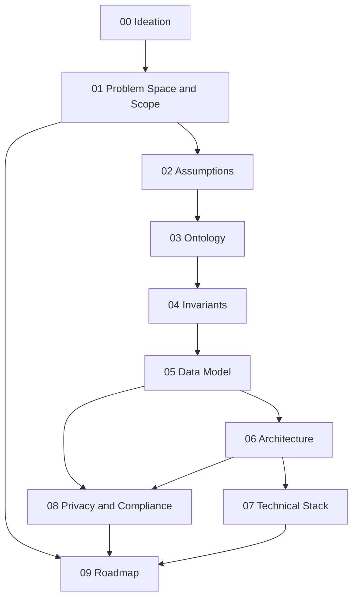

# Sift — Documentation Index

Resume Collector & Interview Analyzer platform for HR teams. This documentation set is meant to be read in order — each document depends on the decisions made in the ones before it, and later documents (data model, architecture) are direct translations of earlier ones (ontology, invariants), not independent designs.

## Reading order

| # | Document | Summary |
|---|---|---|
| 00 | [Ideation](00-ideation.md) | Why this exists, who it's for, and what success looks like six months post-launch. |
| 01 | [Problem Space and Scope](01-problem-space-and-scope.md) | The precise problem statement, a hard in/out-of-scope table, and a watchlist of tempting features deliberately excluded from v1. |
| 02 | [Assumptions](02-assumptions.md) | What must be true about users, resumes, and interview data for this design to hold, each with a confidence level and what breaks if wrong. |
| 03 | [Ontology](03-ontology.md) | The core entities (Candidate, Resume, Application, Interview, Scorecard, etc.), their identity and lifecycle, and what's deliberately not modeled (including derived RAG/AI artifacts). |
| 04 | [Invariants](04-invariants.md) | System-level rules that must always hold, how each is enforced and tested, the Application status state machine, and the invariants extending tenant isolation to vector search (I10, I11). |
| 05 | [Data Model](05-data-model.md) | The concrete schema — every entity as a table with fields, types, and constraints, including the pgvector-backed `resume_chunks` and `analysis_outputs` tables, mapped back to which invariants they enforce. |
| 06 | [Architecture](06-architecture.md) | Components (separate Python backend, RAG vector search pipeline, multi-model LLM crew), the end-to-end and search data flows, the sync/async boundary, and the multi-tenancy isolation design. |
| 07 | [Technical Stack](07-technical-stack.md) | Concrete technology choices per layer — Python/FastAPI backend, pgvector, CrewAI multi-agent orchestration, per-task model assignment — each with a one-line rationale and the alternative rejected. |
| 08 | [Privacy and Compliance](08-privacy-and-compliance.md) | What PII is collected (including embeddings), retention and deletion handling, consent flow, third-party AI subprocessors, and regimes flagged for legal review. |
| 09 | [Roadmap](09-roadmap.md) | The v1/v2/v3 phased build plan, exit criteria between phases, and the timeline. |

## Document dependency graph

## How to use this set

- Start at 00 and read forward the first time through — each document assumes the ones before it.
- If you're implementing a specific layer (e.g., the database), you can jump straight to [05-data-model.md](05-data-model.md), but check its "Depends on" note and skim [03-ontology.md](03-ontology.md) and [04-invariants.md](04-invariants.md) first — the schema is a direct translation of those, not a standalone design.
- Every document ends with an "Open Questions" section. These are not gaps in the writing — they are the specific unresolved decisions that should be revisited before or during the relevant build phase in [09-roadmap.md](09-roadmap.md).
