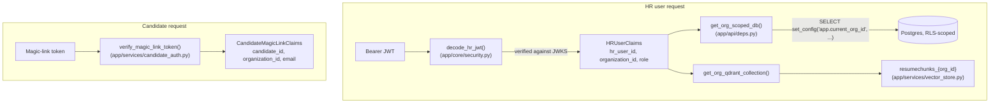

# E1 + E2 — Data Layer & Auth/Tenant Context

**Epics:** [E1 — Foundational Data Layer & Migrations](../../EPIC.md#e1--foundational-data-layer--migrations), [E2 — Auth & Multi-Tenant Request Context](../../EPIC.md#e2--auth--multi-tenant-request-context)
**Branch/PR:** `feature/VHIRE-epics-e1-e2`
**Depends on:** [docs/05-data-model.md](../05-data-model.md), [docs/04-invariants.md](../04-invariants.md), [docs/06-architecture.md](../06-architecture.md)

---

## What's here

E1 stood up the real Postgres schema and the DB-layer half of I2/I3/I4.
E2 stood up the request-context plumbing every later route/worker builds
on: who is making this request, which organization do they belong to,
and where does that organization's data live (Postgres RLS scope +
Qdrant collection name).

Nothing in this chunk exposes an HTTP route yet (`app/main.py` still only
has `/health`) — E1/E2 are pure infrastructure. E3 is the first epic that
wires `app.api.deps` into an actual router.

## File map

```
app/
  db/
    base.py              # async engine, session maker, Base, get_db
  models/
    base.py               # UUIDPkMixin, TimestampMixin, OrgScopedMixin
    enums.py               # Python enums mirroring the Postgres native enums
    organization.py .. audit_log.py   # one module per table
    __init__.py            # imports every model so Base.metadata is complete
  core/
    config.py               # +MAGIC_LINK_SECRET_KEY / MAGIC_LINK_TTL_SECONDS
    security.py             # HR user JWT verification (JWKS)
  services/
    vector_store.py         # Qdrant collection-naming convention only (E7 owns the client)
    candidate_auth.py       # candidate magic-link issuance/verification
  api/
    deps.py                 # get_current_hr_user, get_org_scoped_db,
                             # get_org_qdrant_collection, require_role
alembic/
  env.py                    # target_metadata now points at Base.metadata
  versions/607fb6e98882_initial_schema.py   # the only migration so far
tests/
  models/test_schema.py      # ORM metadata assertions, no DB
  db/test_base.py            # engine/session smoke tests, no DB
  core/test_security.py      # JWT verification, fake JWKS (no network)
  services/test_candidate_auth.py
  services/test_vector_store.py
  api/test_deps.py           # fakes for the security scheme + DB session
  integration/                # real-Postgres tests, see "Running the DB tests" below
    conftest.py
    test_initial_schema.py
```

## Schema (E1)

Every table from [docs/05-data-model.md](../05-data-model.md) exists as
both a SQLAlchemy model and a migration-created Postgres table. Two
mixins carry the repeated shape:

- `UUIDPkMixin` — `id UUID PRIMARY KEY DEFAULT gen_random_uuid()`.
- `TimestampMixin` — `created_at`/`updated_at TIMESTAMPTZ`, DB-assigned
  (`updated_at` has an `onupdate=func.now()` at the ORM level, but the
  Postgres-level guarantee only comes from the app writing through
  SQLAlchemy — there's no trigger enforcing it, since nothing outside
  this app writes to these tables).
- `OrgScopedMixin` — `organization_id UUID NOT NULL REFERENCES organizations(id)`,
  used by every table except `organizations` itself.

`audit_log` deliberately does not use `TimestampMixin` — it has
`created_at` only, no `updated_at`, since a row that's ever updated
violates its own append-only contract (see below).

### DB-layer invariant enforcement

The migration does more than create tables — it's where I2/I3/I4 get a
DB-layer backstop, per the enforcement table in
[docs/05-data-model.md](../05-data-model.md#invariant-enforcement-summary).

| Invariant | Mechanism | Where |
|---|---|---|
| I2 | `ENABLE`+`FORCE ROW LEVEL SECURITY` on every org-scoped table, policy `USING (organization_id = current_setting('app.current_org_id', true)::uuid)` | migration `upgrade()`, loop over `ORG_SCOPED_TABLES` |
| I3 | `BEFORE INSERT OR UPDATE` trigger on `applications` (`enforce_application_org_consistency`) rejecting a row whose `organization_id` doesn't match its `candidate_id`/`job_requisition_id` | migration `upgrade()` |
| I4 | `BEFORE UPDATE` trigger on `scorecards` (`enforce_scorecard_immutability`) rejecting any update to a `submitted` row unless a transaction-local flag is set; `amend_scorecard(...)` stored procedure is the only path that sets that flag, and writes the `audit_log` row in the same transaction | migration `upgrade()` |
| I4 (audit trail) | `BEFORE UPDATE OR DELETE` trigger on `audit_log` (`reject_audit_log_mutation`) — unconditionally raises | migration `upgrade()` |

The I4 mechanism is worth spelling out since it's not the literal
"REVOKE UPDATE at the DB role level" language in
[docs/05-data-model.md](../05-data-model.md) — this app connects to
Postgres as a single role for everything (no separate low-privilege
"HR API" role exists yet), so a blanket `REVOKE UPDATE` would also break
every other legitimate write path. The trigger+flag approach achieves
the same outcome (submitted scorecards can't be edited except through
one audited path) without needing a second DB role. If a dedicated
low-privilege app role is introduced later (a real infra hardening step,
not yet scoped to any epic), the literal REVOKE approach becomes
available as a second, redundant layer — the trigger doesn't need to be
removed for that to work.

**Known gap:** in local dev, `docker-compose.yml`'s `POSTGRES_USER=sift`
is created as a Postgres *superuser* by the official `postgres` image.
Superusers bypass RLS regardless of `FORCE ROW LEVEL SECURITY` — so
`test_rls_enabled_on_every_org_scoped_table` (which checks
`pg_class.relrowsecurity`/`relforcerowsecurity`) passes, but a live query
issued by the `sift` role would **not** actually be filtered by the
policy today. This doesn't block E1/E2 (E1's own DoD says "RLS is on but
not yet exercised by app code — that's E2/E13"), but E13's cross-tenant
test suite will need a non-superuser application role for its I2/I11
assertions to mean anything — flagged here so it isn't rediscovered
from scratch when E13 starts. CI's Postgres service container has the
same characteristic (`POSTGRES_USER` = superuser), so this gap is
invisible in CI too until a dedicated role is provisioned.

### Why the migration was hand-written, not autogenerated

`alembic revision --autogenerate` diffs against a live database, and no
Postgres instance was reachable in the environment this chunk was built
in (no Docker available — see "Running the DB tests" below). The
migration was written by hand instead, directly against the model
definitions, and `alembic/env.py`'s `target_metadata` now points at
`Base.metadata` so **future** migrations (E3 onward, as the schema
evolves) can use `--autogenerate` normally against the tables this one
already created. RLS policies, triggers, and the stored procedure are
never autogenerate output regardless — those always need to be
hand-added to a migration, autogenerated or not.

## Auth & request context (E2)

Two independent identity paths exist, matching the two user types in
[docs/03-ontology.md](../03-ontology.md):



- **`app/core/security.py`** — `decode_hr_jwt(token)` verifies the token's
  signature against the auth provider's JWKS endpoint (`PyJWKClient`,
  cached per-process) and requires `sub`/`org_id`/`role` claims, where
  `role` must be one of `app.models.enums.HRUserRole`. Raises
  `AuthNotConfiguredError` if `AUTH_JWKS_URL` isn't set, or
  `InvalidCredentialsError` for any signature/expiry/claim failure — the
  auth provider itself (Auth0 vs. Clerk) is still an open question in
  [docs/07-technical-stack.md](../07-technical-stack.md), so this module
  only assumes "some RS256 IdP with a JWKS endpoint and these three
  custom claims," not a specific vendor's SDK.
- **`app/api/deps.py`** — the dependency chain routes actually depend on:
  - `get_current_hr_user` — 401s on any `InvalidCredentialsError`.
  - `get_org_scoped_db` — opens a transaction and runs
    `SELECT set_config('app.current_org_id', :org_id, true)` (the
    parameterized equivalent of `SET LOCAL`, chosen because Postgres's
    `SET`/`SET LOCAL` statement syntax doesn't accept bind parameters the
    way a normal query does) before yielding the session. `organization_id`
    always comes from the verified `HRUserClaims`, never a request body/query
    param — this is the concrete answer to the open question I4/I2 raised
    about org_id spoofing.
  - `get_org_qdrant_collection` — same claims, resolves
    `resumechunks_{org_id}` via `app/services/vector_store.py`. E7 will
    extend that module with the actual Qdrant client (provisioning,
    upsert, search); this chunk only adds the naming function so the
    naming scheme lives in one place from the start, per EPIC.md's
    cross-cutting-risks note about embedding-model migrations.
  - `require_role(*roles)` — a dependency factory, 403s if the
    authenticated HR user's role isn't in the allowed set. Not yet used
    by any route (none exist yet) — E3 is the first consumer.
- **`app/services/candidate_auth.py`** — symmetric (HS256) signed tokens,
  not JWKS-based, since candidates aren't issued credentials by an
  external IdP. `issue_magic_link_token` embeds `candidate_id`,
  `organization_id`, `email`, and an expiry (`MAGIC_LINK_TTL_SECONDS`,
  default 900s); `verify_magic_link_token` checks signature, expiry, and
  a `type` claim (so an HR JWT or some other token can't accidentally be
  accepted here). No issuance-tracking/single-use enforcement yet
  (nothing stops replaying a valid, unexpired token) — the ontology
  doesn't currently model a "magic link" as a persisted entity, so
  there's nowhere to record "already used." Worth revisiting once E4
  (resume ingestion, the first real consumer of candidate auth) defines
  what a replay actually risks.

## Running the DB tests

`tests/integration/` needs a reachable `DATABASE_URL`. Locally:

```
docker-compose up -d postgres redis qdrant
.venv\Scripts\python.exe -m pytest tests/integration
```

If Postgres isn't reachable, `tests/integration/conftest.py`'s
session-scoped fixture calls `pytest.skip(...)` rather than failing —
this is why local `pytest` runs (including the one that produced this
chunk's approval diff) show these tests as **skipped**, not passed. CI
now provisions Postgres/Redis/Qdrant as service containers and runs
`alembic upgrade head` before the test step specifically so these tests
execute for real on every PR — treat a green CI run, not a green local
run, as the actual verification that the migration/triggers/RLS work
against Postgres. This is a direct consequence of no Docker being
available in the sandbox this chunk was authored in; if that changes,
prefer running `tests/integration` locally before opening future PRs.

## Definition-of-done check

Per [EPIC.md](../../EPIC.md)'s DoD language:

- **E1:** `alembic upgrade head` runs clean (verified in CI, not locally
  — see above); every table/constraint from
  [docs/05-data-model.md](../05-data-model.md) exists; RLS is *on* (policy
  + FORCE) but not yet exercised by app code — true here, `get_org_scoped_db`
  is the first thing that will exercise it, and it ships in this same
  chunk but no route calls it yet.
- **E2:** no route exists yet to prove "no route can read/write without a
  resolved org context" against, since E3 hasn't shipped — the dependency
  chain itself is complete and unit-tested (`tests/api/test_deps.py`), and
  the enforcement claim will be verified for real once E3's routes depend
  on it.

## Open follow-ups for later epics

- Non-superuser Postgres role for RLS to be meaningful outside a policy
  existence check (see "Known gap" above) — relevant to E13.
- Magic-link replay/single-use semantics — relevant to E4.
- Which managed auth provider (Auth0 vs. Clerk) — still open per
  [docs/07-technical-stack.md](../07-technical-stack.md); `app/core/security.py`
  was written to not need that decision yet (any RS256/JWKS IdP works).
